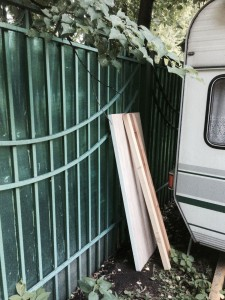
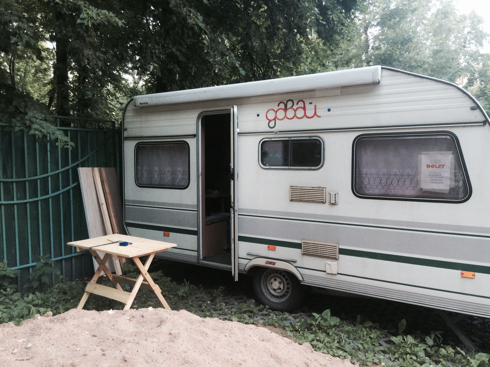
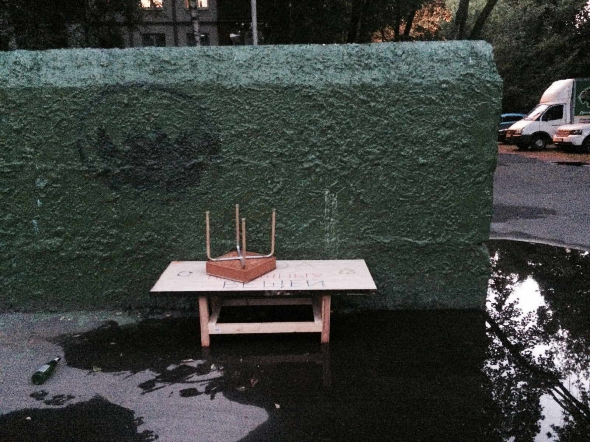

Внезапно около нашего [прицепа-мастерской OOLEY42](http://ooley.ru/places/ooley42/) обнаружились оставленные кем-то неизвестным расходные материалы. Два полутораметровых **бруска 50х50** и большой кусок столешницы из ДСП размером **1400х600 мм** стояли прислонёнными к забору детского сада прямо позади прицепа. Ненужные вещи, которые могут кому-нибудь пригодиться. Но кому и для чего? Обычно ответ на этот вопрос заставляет себя так долго ждать, что вещи не дожидаются и отправляются на помойку. Так могло случиться и в этот раз, но нам пришла отличная идея применения этих материалов. **Дворовый стол для ненужных вещей**!

Далеко не всегда ненужные кому-то в квартире вещи — это мусор, который нужно отвезти на помойку. Часто им просто не находится места после покупки новых вещей или в ходе ремонта. Наш прицеп-мастерская припаркован неподалёку от мусорных контейнеров и для нас не секрет то, как много людей регулярно заглядывает в помойку в поисках чего-то еще пригодного для применения. К тому же мы не раз выносили туда пакеты с ненужной одеждой и обувью и каждый раз удивлялись тому, как оперативно для них находились новые владельцы. Все эти размышления и опыт натолкнули на мысли о том, чтобы собрать специальный столик для таких ненужных кому-то, но вполне подходящих кому-то другому вещей. Особенно круто сделать такой общественный столик из таких же ненужных кому-то материалов. Итак, за дело.

Стол для ненужных вещей не должен быть высоким, главная его функция — немного приподнять и выделить площадку для складирования и обмена всякой всячиной. Постараемся максимально полно воспользоваться материалом, подаренным нам неизвестными. Для этого распилим один брусок на **4 ножки длиной 375 мм** каждая. Второй брусок распилим пополам и получим **две царги для ножек длиной по 750 мм**.

\[su\_slider source="media: 2672,2674,2675" limit="32" link="no" width="720" height="360" title="no" mousewheel="no"\]\[/su\_slider\]

Скрепляем ножки с царгами на высоте около **80 мм над уровнем пола** с помощью длинных черных саморезов. Обычный шуруповёрт может осилить это с трудом, а вот ударный шуруповёрт [Makita TD0101](http://ooley.ru/spisok-instrumentov-mobilnoj-masterskoj-ooley42/) легко справляется с задачей вкручивания таких саморезов в толщу дерева даже без предварительного засверливания отверстий. Из запасов материалов прицепа помимо саморезов в дело пошла также **1 метровая рейка**, распилив которую пополам, мы получили **полуметровые связки** для получившихся пар ножек. Связки притягиваем саморезами покороче и закрепляем это всё вторым рядом саморезов в ножках. Подстолье получилось достаточно крепким и устойчивым. Осталось расположить на нём столешницу, найти места скрепления её с ножками и окончательно собрать столик саморезами. Стол готов.

\[su\_slider source="media: 2676,2677,2678,2679" limit="32" link="no" width="720" height="360" title="no" mousewheel="no" autoplay="4000"\]\[/su\_slider\]

Разноцветными перманентными маркерами мы написали _"Стол для ненужных вещей"_ на столешнице и разместили столик вплотную к стенке помойки. Новый предмет уличной мебели отлично встал и вписался в городской ландшафт. Самое удивительное то, что буквально в течение первых пяти минут столик уже нашёл применение: на нём внезапно появилась первая ненужная вещь — какая-то старая, но довольно симпатичная **табуретка**. Наверняка найдутся те, кому эта вещь понравится или пригодится.

Надеемся, что жители двора оценят нововведение и будут использовать этот общественный столик для обмена ненужными вещами и более полного использования имеющихся ресурсов. Этот проект — важный шаг навстречу местному сообществу. Мы будем внимательно следить за реакцией населения и обязательно расскажем о дальнейшей судьбе столика.

