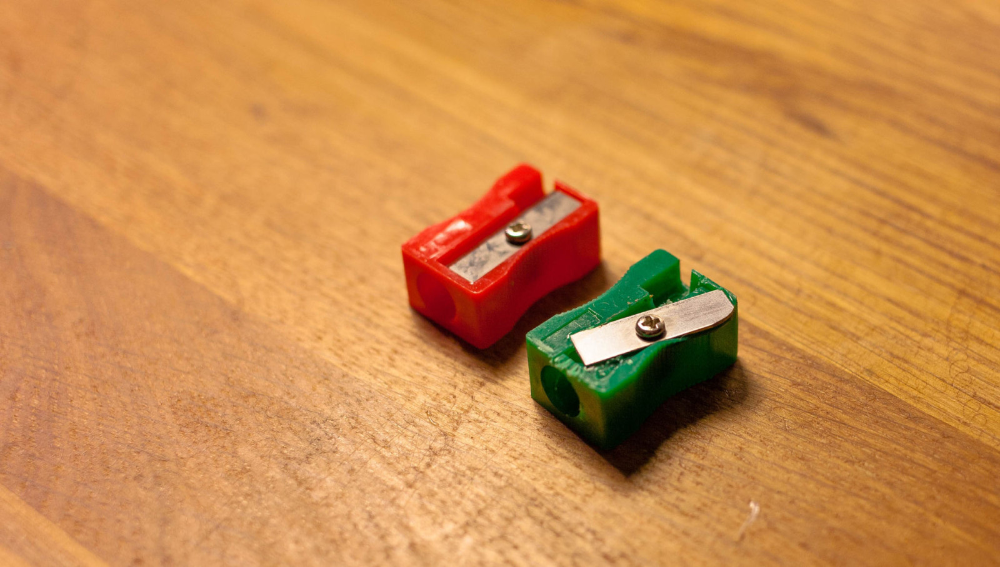

Мы верим, что DIY-движение способно не только разнообразить быт приятными безделушками, но и по-настоящему преобразовать мир, в котором мы живём. Централизованное промышленное производство постепенно уступает место локальному изготовлению вещей и самостоятельной переработке отходов. Даже пустые пластиковые бутылки — не просто мусор, а источник материалов для самых разнообразных проектов!

[Изучение мирового опыта](http://ooley.ru/butylkorez-dlya-polucheniya-termousadochnoj-pet-lenty/)  самостоятельного получения полезной в любом хозяйстве термоусадочной ПЭТ-ленты из обычных пластиковых бутылок привело нас к гениальному в своей простоте и эффективности решению — бутылкорезу из обычной точилки для карандашей.

Мы уже успели не только опробовать это устройство в деле, переработав более десятка бутылок, но и передали это знание в форме [открытого воркшопа на Электромасленице в Битцевском парке](http://ooley.ru/events/rezhem-butylki-na-elektromaslenitse/). Не менее 12 человек своими руками переделали обычные точилки в крайне полезный и, главное, компактный инструмент. За целый день совместного творчества мы сумели усовершенствовать технологию изготовления бутылкорезов и научились делать их буквально за 3 минуты. Спешим поделиться нашими наработками!

Не нужно никаких особенных навыков и умений, чтобы разобраться в этой нехитрой конструкции и сделать бутылкорез из точилки своими руками. Пытливому уму достаточно увидеть образец и, сравнив с оригинальной точилкой, наметить технологическую цепочку.

\[su\_slider source="media: 3536,3537,3538,3539" limit="32" link="no" width="720" height="360" title="no" mousewheel="no" autoplay="5000"\]\[/su\_slider\]

Для работы нам понадобится обычная пластиковая точилка и всего два инструмента: крестовая отвёртка и любой паяльник или другой нагревательный элемент. Первым делом откручиваем единственный винтик и переворачиваем лезвие. Нужно расположить его заточкой вниз и немного повернуть вокруг места крепления так, чтобы нож полностью перекрывал прорезь для стружки. Так, двигаясь вдоль внутренней поверхности точилки, бутылка будет наезжать на лезвие и нарезаться полоской нужной нам толщины. Для того, чтобы закрепить лезвие в его новом рабочем положении, нам нужно вплавить его в точилку с помощью паяльника. Не до конца вкрутив крепёжный винтик, прижимаем к лезвию жало разогретого паяльника, нагревая нож до температуры размягчения пластика. По мере нагрева наступает момент, когда лезвие начинает немного скользить по плавящемуся пластику корпуса точилки. В этот момент важно удержать его в правильном рабочем положении, формируя небольшое углубление для надёжной фиксации. Прогреваем и слегка утапливаем нож с обеих сторон. В этот момент можно немного поэкспериментировать, изменив угол атаки ножа, тем самым корректируя толщину итоговой ленты. Даём лезвию остыть и закручиваем до упора крепёжный винтик. Всё, бутылкорез готов!

\[su\_slider source="media: 3527,3528,3529,3530,3532,3533,3534" limit="32" link="no" width="720" height="360" title="no" mousewheel="no" autoplay="8000"\]\[/su\_slider\]

Теперь можно приступать к раскройке пустых бутылок! Лучше всего для этих целей подходят большие гладкие бутылки без всевозможных узоров и углублений на стенках. Снимаем этикетку и отрезаем донышко, стараясь сделать как можно более ровный отрез. Дальше всё просто: накладываем переделанную точилку на край среза бутылки начинаем проворачивать её, проталкивая на лезвие. За один-два оборота бутылки  наше нехитрое устройство подровняет край пластика и дальше дело пойдёт как по маслу. Лучше всего получается нарезать бутылку, уперев её горлышком себе в живот и вытягивая ленту из бутылкореза свободной рукой. Всего за несколько минут из одной полуторалитровой бутылки можно нарезать до 10 метров прочной пластиковой ленты. Для разной толщины производимых лент можно собрать несколько точилок с разным углом установки лезвия.

[Применений у получаемой ленты масса](http://ooley.ru/butylkorez-dlya-polucheniya-termousadochnoj-pet-lenty/) и многие из них ещё предстоит открыть! Наличие строительного фена позволяет широко экспериментировать термоусадочными и термопластичными свойствами таких лент. Со временем мы сделаем свой обзор их возможностей.

Мы, конечно, собрали уже более десятка таких бутылкорезов и с радостью готовы делиться этими нехитрыми устройствами.  Каждому, кто сделает любой вклад в развитие нашего проекта, мы обязательно подарим готовый бутылкорез или дадим возможность переделать точилку самостоятельно. Благо, точилками мы запаслись и готовы обеспечить даже массовую переработку неэкологичного мусора в полезные в хозяйстве материалы. Ну и, конечно, мы будем рады услышать ваши предложения по применению остающихся в результате нарезки горлышек и донышек пластиковых бутылок!

