Интервью с Сергеем Царевым, креативным директором общественной столярной мастерской «Делай Вещь!» для интернет-журнала BERLOGOS.

**— Сергей, хотелось бы сразу уточнить, насколько тесно связаны «DIY Академия», «Делай Вещь!» и «Механические деревянные шестеренки»?**

— Это все разные проекты, которые живут своей жизнью. «DIY Академию» мы вместе с агентством SKCG разработали для компании BOSCH. Они придумали бренд «DIY Академия», который появился сначала в фэйсбуке. Эта страница настолько хорошо пошла, что академия смогла найти деньги на физическую площадку на Дизайн-заводе «Флакон». Они пригласили меня, я позвал Вячеслава Швайкова как главного мастера, который разработал функционал этой общественной мастерской, подобрал персонал, прописал все базовые программы. Мы запустили площадку. У нас был контракт на год.

«Механические деревянные шестеренки» (МДШ) — это камерный проект Вячеслава в Государственном Центре Современного Искусства, в котором все происходит благодаря его деятельности.

Проект «Делай вещь!» был сделан после опыта с «DIY Академией». Наши друзья и партнеры сложились, можно сказать, по-семейному и сняли большой лофт рядом с метро «Улица 1905 года». Он в два или три раза больше, чем площадка на «Флаконе». Сейчас пытаемся путем опыта и эксперимента простроить бизнес-модель работы с такой площадкой, как Makerspace 1905. «DIY Академия» была маркетинговой компанией бренда, «Делай вещь!» — совсем другой формат.

**— В чем суть революционного формата мастерской, организованной по принципу makerspace?**

— Общественная мастерская — это и школа, и столярный коворкинг. Человек приходит, арендует стол, получает доступ ко всей технике и консультируется у мастера по поводу своего проекта. То есть работает он сам.

Так работает «Делай вещь!» в пространстве Makerspace 1905, так работает «DIY Академия» на «Флаконе», также работают «Механические деревянные шестеренки», только это проект не для широкой публики, а для нашего сообщества: резиденция для дизайнеров и художников.

Сейчас во всем мире открываются так называемые «Makerspace» — пространства, приспособленные для работы руками. Самое важное явление — это, наверное, американский проект Techshop. Это огромное движение, которое зародилось вокруг ЧПУ станков, 3D принтеров и других ставших доступными высокотехнологичных средств производства.

Большой скачок произошел именно тогда, когда непрофессионалам стали доступны недорогие роботизированные станки, 3D принтеры и высокоточный ручной электроинструмент: стало намного проще создание прототипов и тестирование. Ранее нужно было быть большой компанией и вкладывать большие деньги в создание прототипов, поэтому выгодно было делать только крупные тиражи. Теперь множество людей получили доступ к персональным средствам производства.

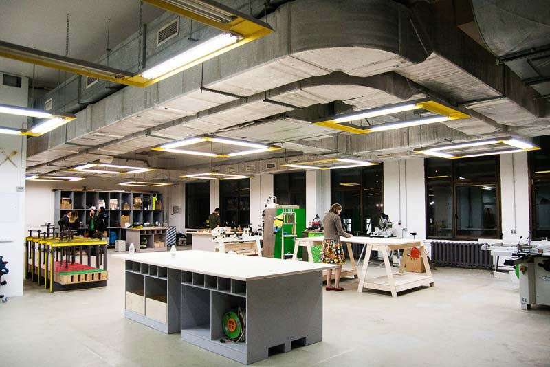

**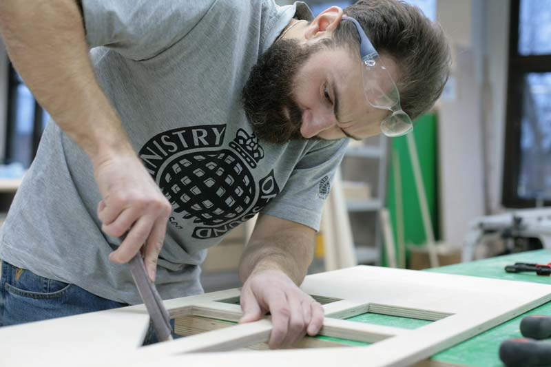**

**— Кто и зачем приходит в открытые мастерские: люди с дизайнерским и художественным опытом или те, кто устал работать за компьютером и хочет отдохнуть?**

**—** Можно выделить несколько аудиторий. В основе своей мы работаем для людей, которые ищут трудотерапию. Они приходят из страхового бизнеса, из банков, из сферы it, один за другим идут креативные и арт-директора рекламных агентств. Эти люди очень развиты интеллектуально, но все они вдохновлены тем, что могут вернуться в реальный мир и поработать руками.

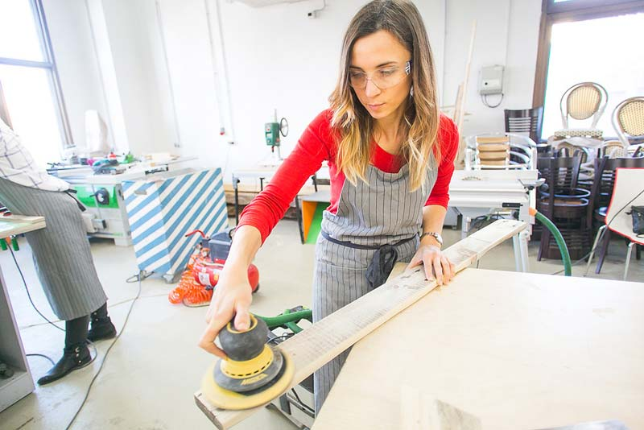

**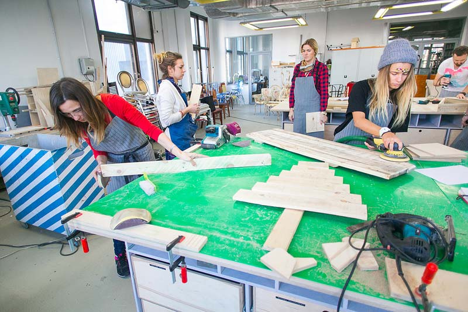**

**— Похоже на фитнес в случае с малоподвижной работой?**

**—** Да, мы тоже часто строим такую аналогию. Многие, попав под кураторство Вячеслава или другого мастера, начинают стабильно ходить именно к нему и работают по своей индивидуальной программе.

Те, для кого мастерская — аналог фитнеса, приходят с небольшими запросами. Кто-то хочет смастерить полочку, кто-то небольшие аксессуары или подарочные коробочки. У них вполне себе утилитарный запрос. Позже у этих людей появляются более серьезные проекты. Уже через год-два человек может начать свою практику, найти свою нишу и свою клиентуру. Одна девушка, например, успешно торгует на маркетах, делая украшения строгих геометрических форм из пород дорогого дерева.

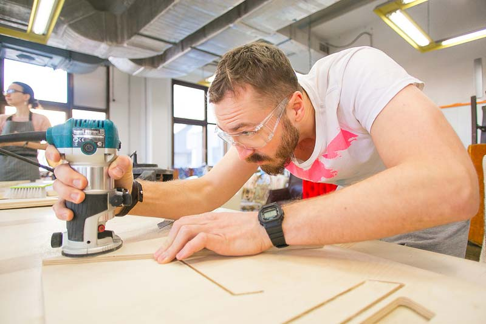

Также к нам приходят люди, которые учатся на архитекторов, промышленных дизайнеров или художников. Они компетентны в истории искусств и архитектуры, в чертежах и рисунке, но им всем не хватает работы с материалом. Как правило, сейчас этому плохо учат. Доходит до того, что архитектор выдает проект, никак не адаптированный под свойства материала и подрядчику приходится брать большую часть проектирования на себя.

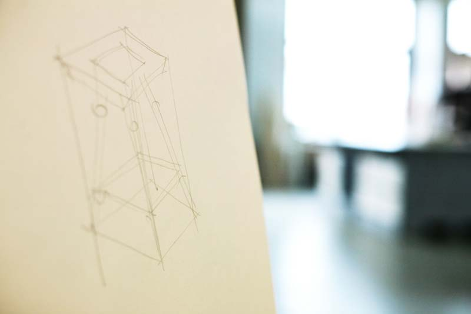

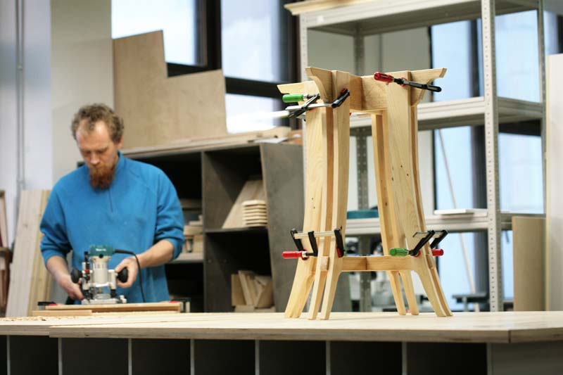

А Вячеслав, на мой взгляд, — классический преподаватель Баухауса (Bauhaus), мастер с большой буквы с классическим пониманием традиций, истории дизайна и истории культур. Он до мозга костей модернист, человек идейный и при этом традиционный реставратор.

Какие-то люди хотят с нуля научиться базовым навыкам, и мы учим их работать с базовым полупрофессиональным электроинструментом. Для них вся притягательность нашей столярки строится вокруг пользования именно этими гаджетами.

_—_ **А в чем разница между профессиональной и непрофессиональной техникой для столярных работ?**

_—_Как правило, это точность, эргономика, откалиброванность инструмента — вот три качества, по которым можно отличить профессиональный и непрофессиональный инструмент. Тут как в фотоаппаратах: линейку Leica любители покупают за счет космической подобранности деталей и ощутимого качества.

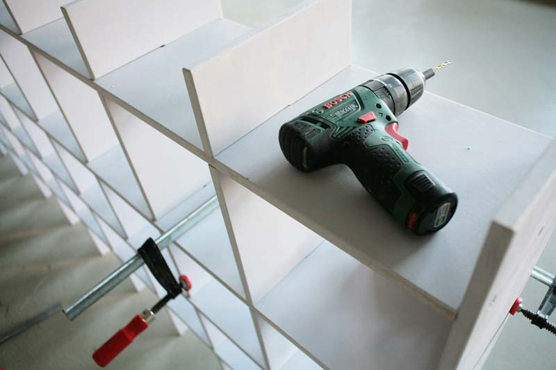

__

_—_ **Раньше, до того как индустриализация отделила дизайн вещей от их производства все делали одни люди — ремесленники. Общественные мастерские, по-вашему, это что: будущее или возвращение к прошлому, к ремесленничеству?**

_—_ Мы всегда отстраиваем себя от традиционных мастеров, от «Ярмарки мастеров», от движения D.I.Y. (Do It Yourself). Мы поддерживаем традицию ремесел, стараемся их развивать, но при этом считаем, что будущее за дизайном.

Будущее за кастомизацией, за онлайн-платформами, которые смогут позволить из некоего конструктора спроектировать объект, заказать его или сделать самому.

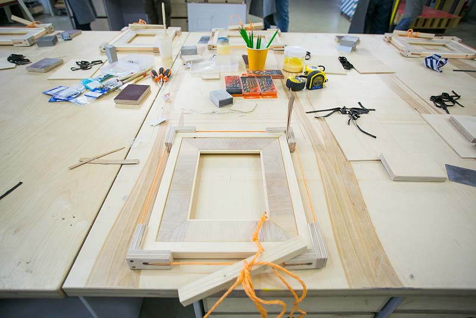

IKEA показала людям дизайнерский подход к решению бытовых проблем. Это важное явление, но нужно двигаться дальше. Мы пытаемся показать, что настало время потихонечку отказываться от массового производства, что можно полностью участвовать в создании собственно пространства и среды. Вместо того чтобы идти в магазин и пытаться подобрать результат массового производства, можно самому создавать единичные вещи с идеологией, с частичкой себя. Чисто психологически они полезнее и приносят больше радости.

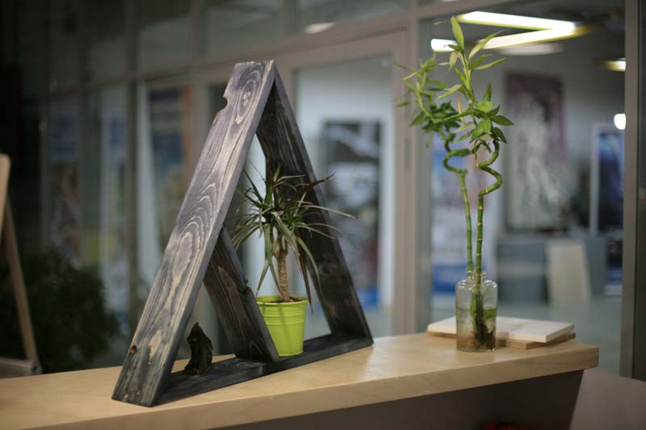

Вячеслав, который, не являясь ни дизайнером, ни архитектором, ни проектировщиком, ни художником, сам по запросу на какое-то столярное изделие выполняет все эти функции автоматически. В мастерской вся команда работает руками на равных. И нет какого-то прямого разделения, кто инженер, кто дизайнер, а кто рабочий.

_—_ **В чем ключевое отличие дизайна от ремесленничества, по Вашему мнению?**

_—_ Ремесло — это всегда дорого. Handmade — это ниша, где чашечка, сделанная на токарном станке хорошим мастером, стоит от 50 евро. Это объект страсти, объект коллекционирования. Мы же стараемся держаться в категории «IKEA умножить на полтора — на два». Разрабатывая прототип, мы думаем, прежде всего, для какой ниши мы работаем, кто наш потребитель, какие у него проблемы и как ему предложить бюджетное решение этой проблемы.

Дизайн и архитектура из качественной фанеры для нас является одним из важных направлений. Хорошая фанера по качеству может сравниться с массивом дерева, но работать с ней гораздо проще. Мы создаем простые функциональные решения, максимально их удешевляем в противовес классическому ремесленничеству.

Наша цель — набрать большую линейку объектов, чтобы люди, придя в мастерскую, из заготовок могли сделать вещи по адекватной стоимости. Мы также стараемся под каждую идею собрать поле экспертов, чтобы сама идея, ее бриф и техническое описание включали в себя многослойную экспертизу, начиная культурологической и заканчивая инженерно-функциональной.

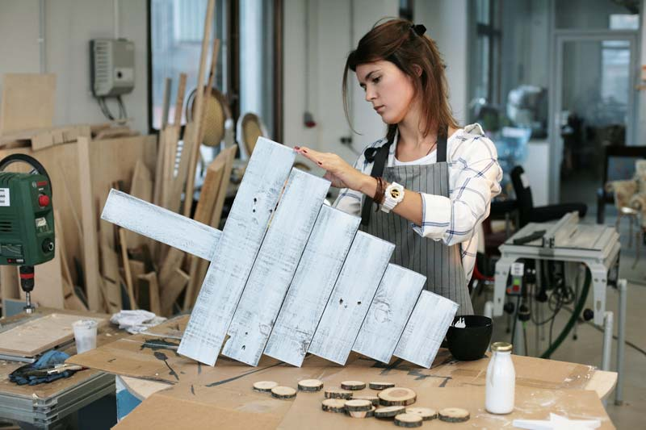

Недавно мы делали проектировочную сессию для появляющегося нового рынка POP-UP торговли. Принцип состоит в постоянном перемещении точек продаж и для этого нужны современные и функциональные торговые конструкции. У новых городских предпринимателей есть запрос на дизайн, но нет ни возможности, ни желания обращаться в дизайн-бюро, потому что это дорого. Они приходят к нам как менеджеры своего проекта, что-то делают сами, что-то посложнее уже заказывают у мастера.

_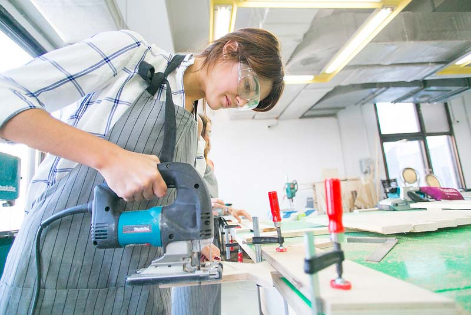_

_—_ **Фанера — это наиболее экономичный материал для дизайна? Если сравнивать по стоимости материалов, что дороже: пластик или дерево?**

_—_ Дерево дороже, но при этом это наиболее простой материал для работы, и он несет в себе определенную эмоцию. В Великобритании есть традиция «Большого обеда» («The Big Lunch»), когда соседи собираются во дворе, чтобы вместе разделить обед за большим деревянным столом. Этим летом мы проведем такой обед совместно с Высшей школой урбанистики, но прежде предложим всем вместе сколотить большие столы, лавки и небольшой кинотеатр из паллет. Такая практика _—_ уже довольно мощный тимбилдинг, это объединяет.

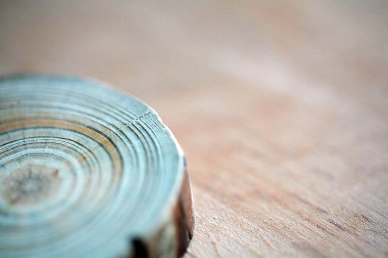

По системе Баухаус (Bauhaus) ученики выбирали себе мастерскую и проходили ее за три года. И только после того, как они постигали систему свойств одного из материалов, они могли быть допущены до системы проектирования. Каждый выбирал материал, который был ему ближе: керамика, стекло, дерево, металл, печатный плакат и так далее.

Все мастерские — одинаково увлекательны. Но в нашей стране культурный код — дерево. От деда к отцу, от отца к сыну передается определенное отношение, традиции. И что касается традиций, то цепочка несколько нарушена, поэтому огромное количество людей приходят именно в столярные мастерские — на работу с деревом.

Фотографии: [Мастерская «Делай вещь!»](http://delaivesch.ru/)

Текст: [Кушаковская Мария](http://www.berlogos.ru/profile/p/kushakovskaya_/)

Оригинал: [BERLOGOS.ru](http://www.berlogos.ru/interview/sergej-carev-obshestvennaya-masterskaya-eto-i-shkola-i-stolyarnyj-kovorking/)
